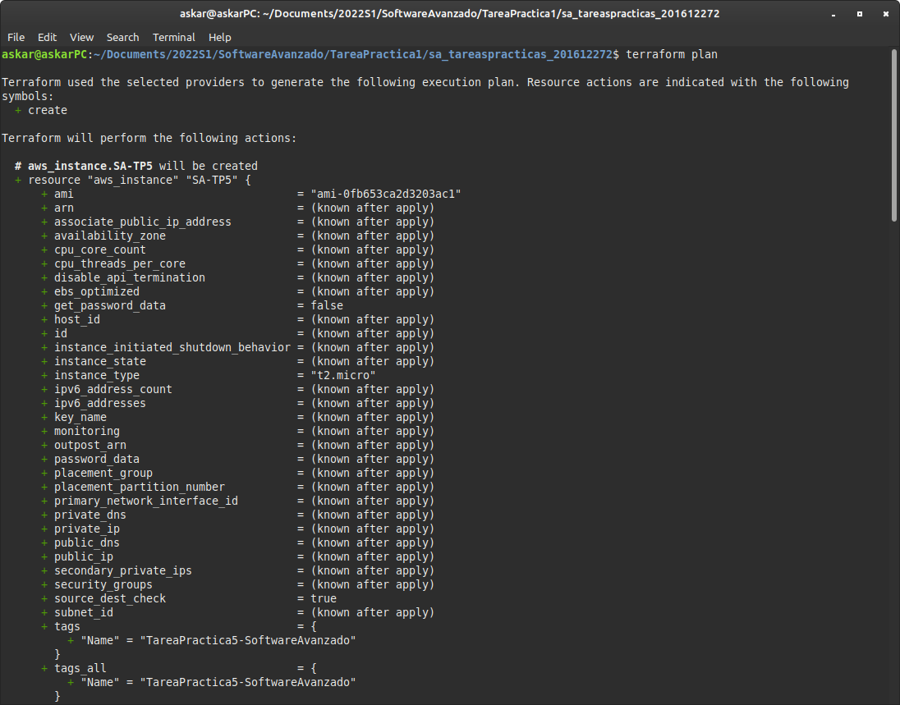
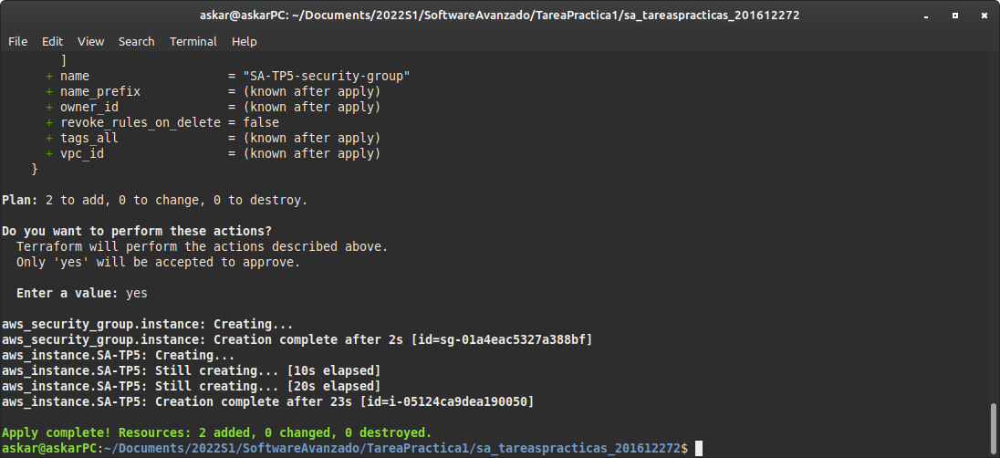

# Prueba de funcionalidad

## Cuenta de proveedor de la nube (AWS)


En la imagen se muestra como el usuario el cual se estará usando para ingresar a la nube de AWS para crear la máquina virtual es __AskarMorales__ el cual tiene permisos de administrador para configurar las instancias de EC2.


Del usuario anterior se puede observar que se tiene una llave para ingresar por medio de programación a las configuración de EC2.

## Instalar Terraform

Para la instalación de Terraform se ingresa a la página de descargas bajo el link de [Página de descargas](https://www.terraform.io/downloads) y se instala la versión para Linux de Terraform en la sección de Ubuntu/Debian y se siguen los pasos para instalarlo.


Cuando se termina de esperar a que hagan efecto las 3 lineas de consola anteriores, se revisa que esté instalado con el siguiente comando para ver la versión de Terraform instalada.

```bash
$ terraform --version
Terraform v1.1.6
on linux_amd64
```

## Archivo de configuración

El archivo de configuración con el nombre de [main.tf](./main.tf) se explican los siguientes pasos:

```tf
variable "my_access_key" {
  description = "Access-key-for-AWS"
  default     = "no_access_key_value_found"
}

variable "my_secret_key" {
  description = "Secret-key-for-AWS"
  default     = "no_secret_key_value_found"
}
```

Se establecen las variables para las llaves de ingreso para el usuario de AWS y las llaves se guardan en un archivo llamado __terraform.tfvars__.

```
provider "aws" {
  region     = "us-east-2"
  access_key = var.my_access_key
  secret_key = var.my_secret_key
}
```

Se usará el proveedor de la nube de AWS el cual la región se establece como la de Ohio.

```
resource "aws_instance" "SA-TP5" {
  ami                    = "ami-0fb653ca2d3203ac1"
  instance_type          = "t2.micro"
  vpc_security_group_ids = [aws_security_group.instance.id]

  tags = {
    Name = "TareaPractica5-SoftwareAvanzado"
  }


  user_data = file("./script.sh")

}
```

Se crea la instalncia de EC2 con la imagen de __Ubuntu 20.04__, un procesador de __t2.micro__ y el nombre de _TareaPractica5-SoftwareAvanzado_. El script para que se ejecute cuando se inicialice la instancia está en el archivo de [script.sh](./script.sh) el cual instala Docker, Docker Compose y Git, clona el repositorio, y ejecuta el proyecto para subir el servidor.

```
resource "aws_security_group" "instance" {
  name = "SA-TP5-security-group"

  ingress {
    from_port   = 3000
    to_port     = 3000
    protocol    = "tcp"
    cidr_blocks = ["0.0.0.0/0"]
  }

  ingress {
    from_port   = 22
    to_port     = 22
    protocol    = "tcp"
    cidr_blocks = ["0.0.0.0/0"]
  }

  egress {
    from_port   = 0
    to_port     = 0
    protocol    = "-1"
    cidr_blocks = ["0.0.0.0/0"]
  }
}

Finalmente crea el security group para abrir los puertos que se van a utilizar: el puerto 3000 para el servicio, el puerto 22 para la conexión SSH y que envie a cualquier dirección las respuestas.

```

## Inicializar Terraform

Para inicializar Terraform se ejecuta con el comando de `terraform init` e instala todas las librerías necesarias para ejecutar el proyecto


## Plan de Terraform

Para ejecutar los planes de Terraform se ejecuta con el comando de `terraform plan` el cual muestra que es lo que va a realizar con detalle según el proyecto




## Aplicar Terraform

El comando de `terraform apply` realiza todas las acciones correspondientes para crear la instancia y correr el proyecto en la nube.




## Consumir servicio

### SSH

Se revisa por medio de conexión SHH que se haya clonado el repositorio y se haya levantado el proyecto 


### Petición

Se revisa el proyecto levantado bajo la ip de la instancia de AWS ejecutado. El cual se puede observar la respuesta que retorna.


## Destruir Terraform

Para destruir el proyecto, apagar la instancia y borrar todo, se ejecuta el comando de `terraform destroy`


Se corrobora que la instancia de EC2 de AWS esté terminada y apagada.


## Video

https://drive.google.com/file/d/1Jn2geFTxnugGhRl_eVLhL35bT_fbBh_K/view?usp=sharing
